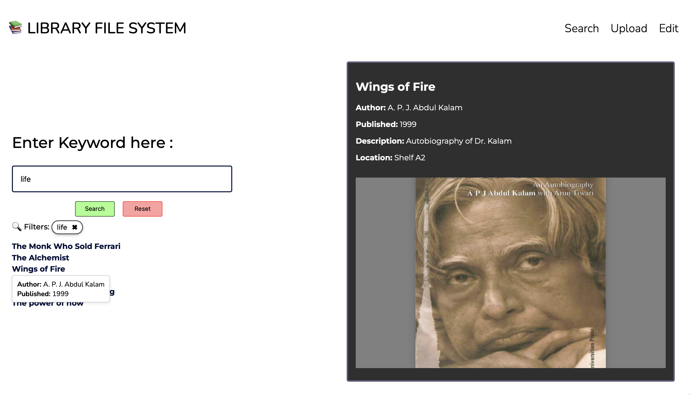
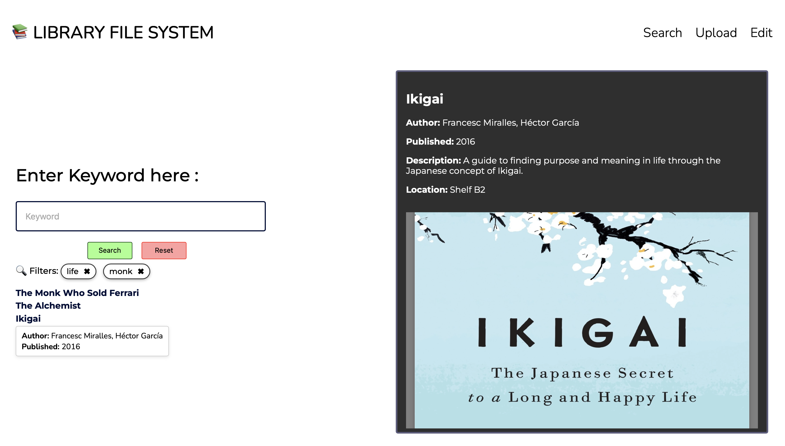
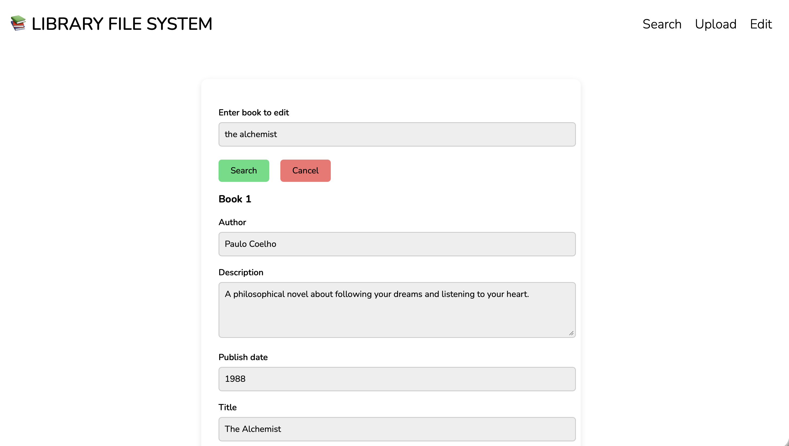
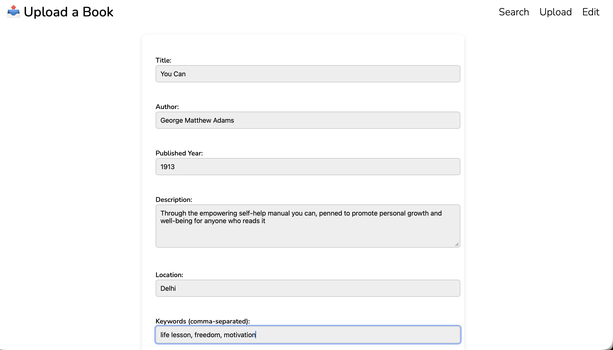

# 📚 File System Simulation Portal

A secure, keyword-driven digital library retrieval system developed during my internship at DRDO.

---

## 🚀 Problem Statement

In research labs and institutional libraries, books are frequently misplaced or returned to incorrect shelves.  
Users may not know the exact title or physical location of a required book.

### This project addresses:

- Difficulty in locating books without exact titles
- Misplacement within physical library shelves
- Manual dependency on librarians for tracking
- Lack of searchable metadata-based retrieval

---

## 🧠 Solution Overview

The File System Simulation Portal provides:

- Keyword-based book discovery
- Dynamic metadata filtering
- Role-based access control (RBAC)
- Structured shelf-location tracking
- Integrated PDF preview with detailed metadata

The system simulates a secure internal digital library environment for research institutions.

---

## 🏗 System Architecture

**Frontend:** HTML, CSS, JavaScript  
**Backend:** Python (Flask)  
**Database:** SQLite  
**Document Handling:** Metadata indexing + PDF storage  

---

## 👥 User Roles

### 🔍 Public User
- Search books using partial keywords
- View filtered results
- Preview book PDF
- Access metadata (author, pages, location)

### 🔐 Authorized User (Library Admin)
- Upload new book PDFs
- Add or modify metadata
- Update incorrect shelf locations
- Replace or edit stored documents

---

## 🔎 Core Features

### 1️⃣ Keyword-Based Search

Users can:
- Enter partial keywords (e.g., "life")
- Retrieve dynamically filtered book lists
- Perform multiple keyword attempts

**Example:**  
Typing `"life"` may return:

- The Monk Who Sold His Ferrari  
- The Alchemist  
- Wings of Fire  
- Ikigai  
- Man's Search for Meaning  
- The Power of Now  

---

### 2️⃣ Book Detail Preview

Upon selecting a book, the right-side panel displays:

- 📍 Shelf Location  
- ✍️ Author  
- 📄 Number of Pages  
- 📘 Title  
- 📑 Embedded PDF Preview  

This enables quick verification before physically locating the book.

---

### 3️⃣ Upload Module (Restricted Access)

Authorized users can:

- Upload new books
- Add structured metadata
- Store documents within database index

Ensures controlled library expansion.

---

### 4️⃣ Edit Module (Restricted Access)

Admins can:

- Update incorrect shelf locations
- Modify metadata
- Replace existing PDFs

Prevents long-term catalog inconsistencies.

---

## 📸 Application Screenshots

### 🔎 Search Interface


### 📚 Filtered Results


### 📖 Book Edit Panel


### 🔐 Admin Upload Panel


---

## 🛠 Tech Stack

- Python
- Flask
- SQLite
- HTML/CSS
- JavaScript

---

## 🧪 How to Run Locally

```bash
git clone https://github.com/disharathore/File-System
cd File-System
pip install -r requirements.txt
python app.py
Open in browser:

http://localhost:5000

🌐 Live Demo

https://disharathore.github.io/File-System/index.html
