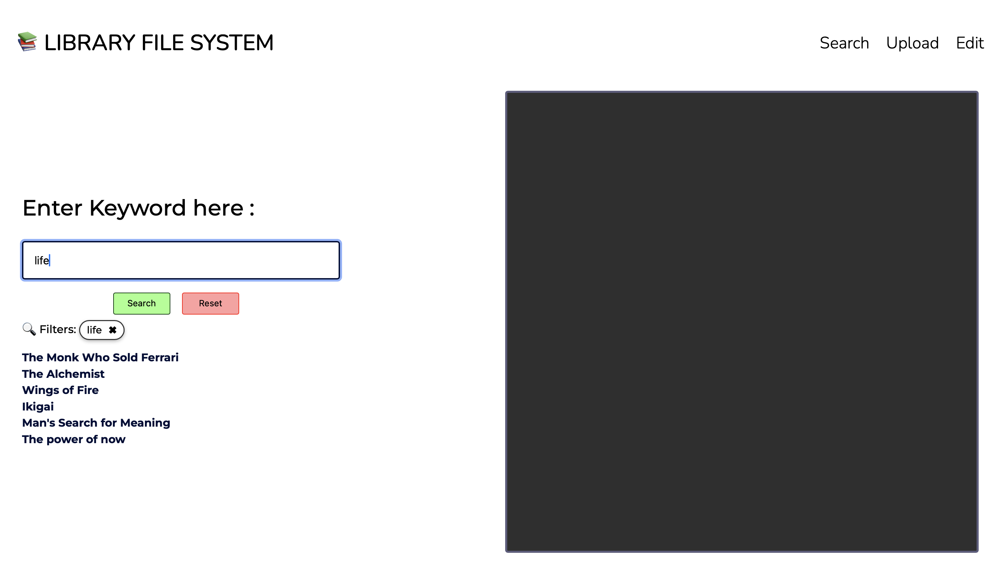

# 📚 File System Simulation Portal  
A secure, keyword-driven digital library retrieval system developed during my internship at DRDO.

---

## 🚀 Problem Statement

In research labs and institutional libraries, books are often misplaced or returned to incorrect shelves.  
Users may not know the exact title or physical location of a book.

This project solves:

- Difficulty in locating books by exact title
- Misplaced books within library shelves
- Manual dependency on librarians for location tracking
- Lack of searchable metadata system

---

## 🧠 Solution Overview

The File System Simulation Portal enables:

- Keyword-based book discovery
- Real-time metadata filtering
- Role-based access for editing and uploading
- Structured location tracking
- PDF preview with complete metadata

It simulates a secure internal library system for research environments.

---

## 🏗 System Architecture

- Frontend: JavaScript, HTML/CSS
- Backend: Python (Flask/FastAPI – adjust to yours)
- Database: SQLite
- Document Storage: Structured metadata + PDF indexing

---

## 👥 User Roles

### 🔍 Public User
- Can search books using keywords
- Can view filtered results
- Can preview PDF
- Can see metadata (location, author, pages)

### 🔐 Authorized User (Library Admin)
- Can upload new books
- Can edit book metadata
- Can update incorrect locations
- Can modify PDF file

---

## 🔎 Core Features

### 1️⃣ Keyword-Based Search

Users can:
- Enter partial keywords (e.g., "life")
- System filters matching books
- Displays a list of relevant titles

Example:
Typing "life" may return:
- The Monk Who Sold His Ferrari
- The Alchemist
- Wings of Fire
- Ikigai
- Man's Search for Meaning
- The power of now

Search supports:
- Multiple keyword attempts
- Flexible matching logic
- Structured filtering

---

### 2️⃣ Book Detail Preview

When a user selects a book:

Right-side panel displays:
- 📍 Shelf Location
- ✍️ Author
- 📄 Number of Pages
- 📘 Book Title
- 📑 PDF Preview

This allows:
- Immediate verification before physically locating the book

---

### 3️⃣ Upload Feature (Restricted Access)

Authorized users can:
- Upload new book PDFs
- Add metadata (title, author, location)
- Store books in structured database format

Ensures:
- Library expansion capability
- Controlled document management

---

### 4️⃣ Edit Feature (Restricted Access)

If a book is found in a different shelf:

Admin can:
- Update location metadata
- Modify book details
- Replace PDF if needed

Prevents long-term misplacement errors.

---

## 📸 Screenshots

### 🔎 Search Interface



### 📚 Filtered Results


### 📖 Book Edit Panel


### 🔐 Admin Upload Page


---

## 🛠 Tech Stack

- Python
- SQLite
- JavaScript
- HTML/CSS

---

## 🧪 How to Run Locally

```bash
git clone https://github.com/disharathore/File-System
cd File-System
pip install -r requirements.txt
python app.py
Open:

http://localhost:5000
🌐 Live Demo

[Live Application Link Here]
